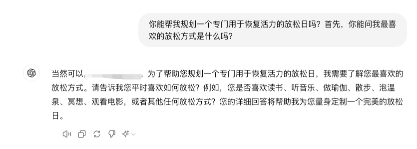

# Emotional_agent
基于书生浦语大模型打造情感具像化的对话LLM,提供丰富情绪价值
我称之为 情感智能体
## 解决什么问题？
让我们来看看现今大模型市场上的对话体验:

先不论技术实力如何 如果是在实时对话的时候 用户体验感极乎归0

而NIO 蔚来汽车的是怎么做的呢？
使用nomi的小屏幕具像化智能体的情况（虽然他们的大模型能力确实一般）
但是是不是比其他车企的智能助手体验更上一层楼？
因此本项目将通过智能体的回答（情绪）具像化此刻大模型的表情

## 实现路径
👷
## 团队成员
😚您的加入